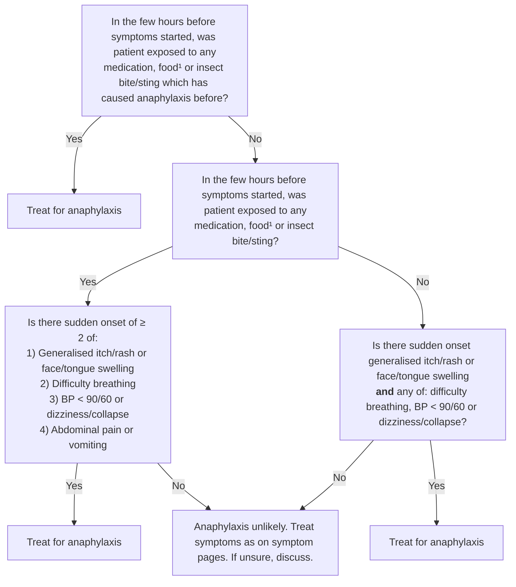

# Page 20 – Anaphylaxis: flowchart

Source: `static/medical-resources/za/primary-care/adult/thumbnails/full-size/20.png` (red box).

¹ Common foods causing anaphylaxis: peanuts, tree nuts, egg, milk and fish.

## Decision nodes → rules

| Node | Modelled as | Rule |
|---|---|---|
| Q1 = Yes | Exposure to a substance **and** a recorded allergy to the same substance (fish, milk, egg, peanut, tree nut, drug) or insect bite/sting **and** allergy to insect venom | `Diagnose probable anaphylaxis`, first `or` branches |
| Q2 = Yes → Q3 = Yes | Any exposure (food, drug, insect bite/sting) **and** `any2` of the four symptom groups. Sudden-onset qualifier applied to the skin group | `Diagnose probable anaphylaxis`, `(and (or exposures) (any2 …))` branch |
| Q2 = No → Q4 = Yes | Sudden-onset skin group **and** any of difficulty breathing, BP < 90/60, dizziness, collapse. The page's Q4 text omits abdominal pain/vomiting; the rule keeps them out too | `Diagnose probable anaphylaxis`, last `and` branch |
| Pre-screen (what makes us ask the questions at all) | Any sudden-onset skin sign alone, or `any2` of insect bite/sting, itch, rash, face/tongue swelling, difficulty breathing, dizziness, collapse, low BP | `Diagnose possible anaphylaxis` → triggers `Check for Anaphylaxis` |
| Treat for anaphylaxis | `(active_condition Anaphylaxis)` → Urgent + management tasks | `Urgent: Anaphylaxis`, `Raise legs`, `Administer …` |

## Notes

- "In the few hours before" is not modelled as a time comparison; exposures are recorded in the
  current encounter, which is taken to mean recent.
- BP < 90/60 is read as systolic < 90 **or** diastolic < 60.
- The lower half of the page (assess/advise the patient with previous anaphylaxis) is routine care
  and is not modelled.
